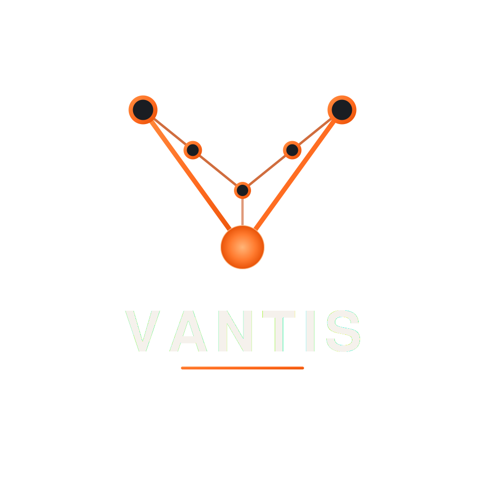

<p align="center">
  
</p>

<h1 align="center">
Vantis Frontend
</h1>

<p align="center">
Building software infrastructure — not just applications.
</p>

<p align="center">

<br>

[Website](https://vantis.ir)
•
[GitHub](https://github.com/vantisio)
•
Contact Us: contact@vantis.ir

</p>

---

## Overview

This repository contains the official frontend of the Vantis engineering platform.

The project represents the public identity of Vantis and showcases our engineering philosophy, products, documentation, investment proposals, and technical architecture through a modern web experience.

Rather than being a traditional marketing website, this project was designed with an engineering-first mindset, emphasizing maintainability, scalability, accessibility, and long-term architecture.

---

## Philosophy

At Vantis we believe software should be built like infrastructure.

Every design decision, animation, component, and interaction exists for a reason.

The goal is not visual complexity.

The goal is clarity, performance, and engineering quality.

---

## Tech Stack

- Next.js (App Router)
- React
- TypeScript
- Tailwind CSS
- Framer Motion
- shadcn/ui
- next-intl
- Lucide Icons

---

## Features

- Modern engineering-focused landing page
- Fully responsive layout
- RTL & Persian localization
- Dark / Light mode
- Smooth page navigation
- Product architecture pages
- Protected proposal documentation
- Password-gated investor documentation
- Documentation-style navigation
- Modular component architecture
- Production-ready codebase

---

## Project Structure

```
app/
components/
features/
hooks/
lib/
messages/
public/
styles/
```

---

## Design Principles

- Engineering First
- Accessibility
- Performance
- Scalability
- Clean Architecture
- Pixel Perfect UI
- Component Driven Development

---

## Performance

The project focuses on:

- Server Components
- Route-based code splitting
- Optimized fonts
- Optimized images
- Lazy loading
- Minimal client-side JavaScript
- SEO optimization

---

## Documentation

Investor documentation is protected through server-side authentication using:

- Route Handlers
- Middleware
- HttpOnly Cookies
- Environment Variables

No passwords are exposed to the client.

---

## Development

```bash
pnpm install

pnpm dev
```

Build

```bash
pnpm build
```

Start

```bash
pnpm start
```

---

## License

This repository is proprietary.

All rights reserved.

No part of this project may be copied, redistributed, modified, or used without explicit written permission from Vantis.

---

<p align="center">

Built with ❤️ by the Vantis Engineering Team

</p>
